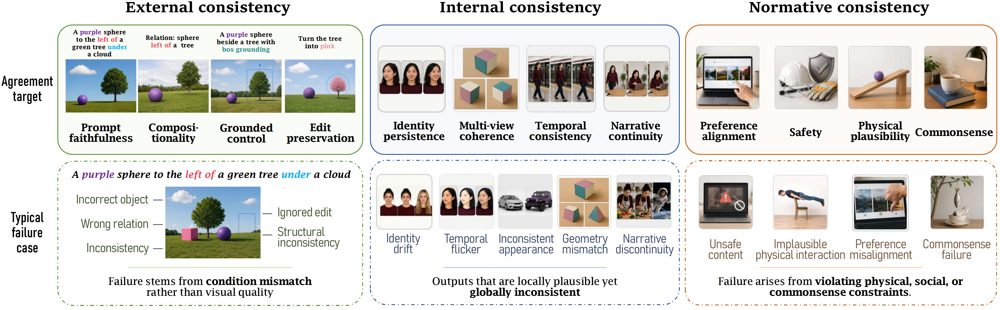
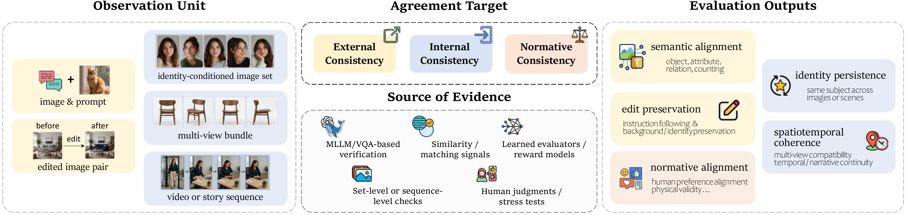
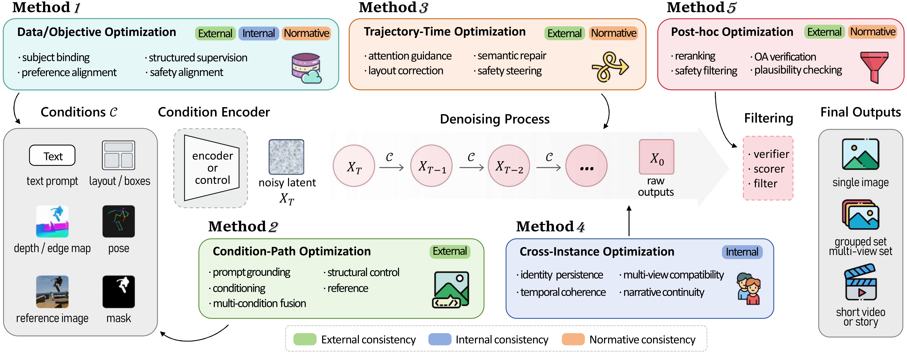

<a id="top"></a>

<div align="center">

# Consistency in Diffusion-Based Visual Generation: A Survey

<p>
  
  &nbsp;&nbsp;&nbsp;&nbsp;
  
  &nbsp;&nbsp;&nbsp;&nbsp;
  
  &nbsp;&nbsp;&nbsp;&nbsp;
  
</p>

<p>
  <a href="https://www.preprints.org/manuscript/202606.0870/v1"></a>
  <a href="https://doi.org/10.20944/preprints202606.0870.v1"></a>
  <a href="https://awesome.re"></a>
  <a href="LICENSE"></a>
</p>

<p>
  <a href="#overview">Overview</a> ·
  <a href="#taxonomy">Taxonomy</a> ·
  <a href="#evaluation-and-optimization">Evaluation & Optimization</a> ·
  <a href="#resource-collection">Resources</a> ·
  <a href="#machine-readable-resources">Data Files</a> ·
  <a href="#contribution-guide">Contribute</a> ·
  <a href="#citation">Citation</a>
</p>

</div>

---

## Overview

This repository accompanies the survey:

> **Consistency in Diffusion-Based Visual Generation: A Survey**  
> Song Yan, Wei Zhai, Chenfeng Wang, Ruixuan Li, Zhangping Yang, Yancheng Cai, Tao Zhang, Ling Wang, Yunwei Lan, Yujie He, Yang Cao, Min Li, and Zheng-Jun Zha.  
> *Preprints*, 2026 · [Paper](https://www.preprints.org/manuscript/202606.0870/v1) · [DOI](https://doi.org/10.20944/preprints202606.0870.v1)

Diffusion models now support text-to-image synthesis, editing, personalization, video generation, and 3D-aware content creation. Visual fidelity alone, however, does not guarantee that an output follows its prompt, preserves identity, remains coherent over time or viewpoint, or satisfies safety and physical-plausibility requirements.

The survey organizes these failures through a single question:

> **What should a generated visual output agree with?**

Its answer is a relation-based taxonomy of **external**, **internal**, and **normative** consistency. The repository turns this taxonomy into a navigable literature map covering representative methods, benchmarks, evaluators, datasets, and diagnostic resources.

### Key contributions

1. **Relation-based taxonomy** — organizes consistency according to the target of agreement rather than only by task or modality.
2. **Evaluation protocol abstraction** — separates observation units, agreement targets, evidence sources, and evaluation outputs.
3. **Optimization-locus analysis** — compares where consistency is imposed: before sampling, at the condition interface, during denoising, across coupled outputs, or after generation.
4. **Machine-readable resource map** — provides structured CSV and BibTeX files for maintenance, comparison, and downstream analysis.

<p align="center">
  
  
  
  
</p>

---

## Taxonomy

<p align="center">
  <a href="paper/Cons_01.png">
    
  </a>
</p>

<p align="center"><sub><b>Figure 1.</b> Three consistency relations in diffusion-based visual generation.</sub></p>

| Relation | Agreement target | Representative failures | Typical settings | Resources |
|---|---|---|---|---:|
| **External consistency** | Prompts, references, layouts, masks, poses, controls, and editing instructions | Prompt omission, attribute-binding error, counting error, control mismatch, over-editing | Text-to-image generation, structural control, editing, inpainting, virtual try-on, typography | **125** |
| **Internal consistency** | Generated subjects, views, frames, shots, instances, and story states | Identity drift, view inconsistency, temporal flicker, state forgetting, narrative discontinuity | Personalization, multi-view/3D generation, video generation, story visualization | **123** |
| **Normative consistency** | Preference, safety, fairness, physical plausibility, commonsense, and causal/world-state criteria | Low preference, unsafe output, benign-capability loss, physical violation, causal failure | Preference optimization, safety editing, concept erasure, physical and world-model evaluation | **107** |

The categories are conceptually distinct but practically entangled. A method may address several relations simultaneously; the repository places it according to its **primary agreement target** while retaining its broader diagnostic role in the description and coverage files.

---

## Evaluation and optimization

<table>
<tr>
<td width="50%" valign="top" align="center">
  <a href="paper/Eval_01.png"></a>
</td>
<td width="50%" valign="top" align="center">
  <a href="paper/Optimize_01.png"></a>
</td>
</tr>
<tr>
<td valign="top">
  <b>Evaluation view.</b> A consistency claim should specify the observation unit, agreement target, evidence source, and evaluation output. This prevents sequence-level claims from being supported only by frame-level evidence, or specific alignment claims from being reduced to broad preference scores.
</td>
<td valign="top">
  <b>Optimization view.</b> Consistency can be imposed before sampling, at the condition interface, during denoising, across coupled outputs, or after generation. Each locus creates different trade-offs among persistence, controllability, realism, diversity, memory cost, and modularity.
</td>
</tr>
</table>

---

## Resource collection

The literature map is organized first by consistency relation and then by resource type:

- **Methods** — model architectures, training objectives, inference-time guidance, editing mechanisms, alignment strategies, and verification pipelines.
- **Benchmarks & Evaluators** — test suites, automatic metrics, learned scorers, human-evaluation protocols, and stress tests.
- **Datasets & Data Resources** — training corpora, preference data, structured annotations, and diagnostic prompt sets.

Each entry follows a compact format:

> **Title** *(venue/year or source)* — the consistency issue, mechanism, or diagnostic role addressed by the resource.

> [!NOTE]
> Recent papers may temporarily be labeled **arXiv**, **project**, or **venue TBD** until stable proceedings metadata becomes available. Official paper repositories and project pages are preferred over unofficial reimplementations.

---

## External consistency

> **Agreement target:** Agreement with externally specified conditions.  
> **Scope:** Prompts, layouts, boxes, masks, depth maps, poses, reference images, editing instructions, and other user- or task-provided controls.

<details open>
<summary><strong>Methods</strong> · 85 entries</summary>

<br>

- [GLIDE](https://arxiv.org/abs/2112.10741) *(arXiv 2022)* — Early text-guided diffusion model supporting prompt-conditioned generation and editing.
- [Imagen](https://arxiv.org/abs/2205.11487) *(NeurIPS 2022 / arXiv)* — High-fidelity text-to-image diffusion model emphasizing language understanding.
- [Latent Diffusion Models](https://arxiv.org/abs/2112.10752) *(CVPR 2022)* — Latent-space diffusion backbone widely used for controllable generation and editing.
- [Composable Diffusion Models](https://arxiv.org/abs/2206.01714) *(ECCV 2022)* — Combines multiple diffusion score functions for compositional generation.
- [Structured Diffusion Guidance](https://arxiv.org/abs/2212.05032) *(arXiv 2022)* — Uses structured guidance signals to improve prompt-object alignment. (Same paper as StructureDiffusion, L68)
- [StructureDiffusion](https://arxiv.org/abs/2212.05032) *(arXiv 2022)* — Parses prompts into structured representations to improve compositional text-to-image generation.
- [Attend-and-Excite](https://github.com/yuval-alaluf/Attend-and-Excite) *(SIGGRAPH 2023)* — Manipulates cross-attention maps to reduce missing objects and improve prompt coverage [Paper](https://arxiv.org/abs/2301.13826)
- [BoxDiff](https://github.com/showlab/BoxDiff) *(ICCV 2023)* — Training-free box-constrained generation for spatially grounded text-to-image synthesis [Paper](https://arxiv.org/abs/2304.14361)
- [Composer](https://github.com/damo-vilab/composer) *(ICML 2023)* — Composes heterogeneous visual conditions for controllable image synthesis [Paper](https://arxiv.org/abs/2302.09778)
- [MultiDiffusion](https://multidiffusion.github.io/) *(ICML 2023)* — Fuses multiple diffusion paths to satisfy spatial and regional generation constraints.
- [LLM-grounded Diffusion](https://llm-grounded-diffusion.github.io/) *(ICLR 2024)* — Uses LLM planning to turn complex prompts into layout-grounded generation constraints.
- [SynGen](https://arxiv.org/abs/2308.07037) *(ICCV 2023)* — Uses syntactic guidance to improve compositional text-to-image generation.
- [RPG: Recaption, Plan, and Generate](https://github.com/YangLing0818/RPG-DiffusionMaster) *(arXiv 2024)* — Uses MLLM-based recaptioning and planning for complex prompt following [Paper](https://arxiv.org/abs/2312.03701)
- [CONFORM](https://arxiv.org/abs/2309.14773) *(arXiv / venue TBD)* — Improves object-attribute alignment through contrastive or correspondence-driven prompt grounding.
- [Divide-and-Bind](https://arxiv.org/abs/2308.06769) *(arXiv / venue TBD)* — Decomposes complex prompts and binds objects to attributes or relations.
- [Linguistic Binding in Diffusion](https://arxiv.org/abs/2308.06769) *(arXiv / venue TBD)* — Studies or improves language-binding failures in text-to-image diffusion.
- [Promptist](https://arxiv.org/abs/2212.09611) *(arXiv 2022)* — Optimizes prompts to improve text-to-image generation quality and alignment.
- [BeautifulPrompt](https://arxiv.org/abs/2312.07358) *(AAAI 2024 / arXiv)* — Refines user prompts for stronger image generation quality and faithfulness.
- [Prompt Expansion for Text-to-Image](https://arxiv.org/search/?query=prompt+expansion+text+to+image+diffusion&searchtype=all) *(topic / resource)* — Expands underspecified prompts to reduce ambiguity in generation.
- [Prompt Decomposition for T2I](https://arxiv.org/search/?query=prompt+decomposition+text-to-image+evaluation&searchtype=all) *(topic / resource)* — Decomposes prompts into atomic semantic constraints for evaluation or guidance.
- [ControlNet](https://github.com/lllyasviel/ControlNet) *(ICCV 2023)* — Adds trainable side branches for depth, edge, pose, segmentation, and other controls [Paper](https://arxiv.org/abs/2302.05543)
- [GLIGEN](https://github.com/gligen/GLIGEN) *(CVPR 2023)* — Grounds generation with boxes and phrase-level grounding tokens [Paper](https://arxiv.org/abs/2301.07093)
- [T2I-Adapter](https://github.com/TencentARC/T2I-Adapter) *(AAAI 2024)* — Uses lightweight adapters for structural conditions such as sketch, depth, and pose [Paper](https://arxiv.org/abs/2302.08453)
- [IP-Adapter](https://github.com/tencent-ailab/IP-Adapter) *(arXiv 2023)* — Adds image-prompt conditioning while preserving text compatibility [Paper](https://arxiv.org/abs/2308.06721)
- [AnyDoor](https://github.com/ali-vilab/AnyDoor) *(CVPR 2024)* — Performs zero-shot object-level customization and insertion [Paper](https://arxiv.org/abs/2307.09481)
- [FreeDoM](https://github.com/vvictoryuki/FreeDoM) *(ICCV 2023)* — Applies training-free energy guidance for conditional diffusion tasks [Paper](https://arxiv.org/abs/2303.16747)
- [HumanSD](https://github.com/IDEA-Research/HumanSD) *(ICCV 2023)* — Generates human images under native skeleton guidance [Paper](https://arxiv.org/abs/2303.16747)
- [UniControl](https://arxiv.org/abs/2305.11147) *(NeurIPS 2023 / arXiv)* — Provides a unified framework for multiple controllable generation signals.
- [Uni-ControlNet](https://arxiv.org/abs/2305.16322) *(arXiv 2023)* — Unifies multi-condition ControlNet-style conditioning.
- [Ctrl-Adapter](https://openreview.net/forum?id=ny8T8OuNHe) *(ICLR 2025)* — Uses efficient adapters for diverse spatial and structural controls.
- [UniCon](https://openreview.net/forum?id=8jb0e1gLyd) *(ICLR 2025)* — Designs unidirectional information flow for stronger large-scale condition control.
- [InstanceDiffusion](https://people.eecs.berkeley.edu/~xdwang/projects/instancediffusion/) *(CVPR 2024)* — Supports instance-level control over object placement and attributes.
- [ControlNet++](https://arxiv.org/abs/2312.04462) *(arXiv / venue TBD)* — Improves ControlNet-style conditioning quality and efficiency.
- [ControlNet-XS](https://arxiv.org/abs/2312.05773) *(arXiv / venue TBD)* — Compresses controllable generation modules for efficient deployment.
- [ControlLoRA](https://arxiv.org/abs/2402.06551) *(arXiv / venue TBD)* — Uses LoRA-style lightweight control adaptation.
- [SparseCtrl](https://arxiv.org/abs/2311.16933) *(arXiv / venue TBD)* — Controls image/video generation from sparse visual conditions.
- [SemanticControl](https://arxiv.org/search/?query=SemanticControl+diffusion&searchtype=all) *(arXiv / venue TBD)* — Handles loose or weakly aligned semantic controls.
- [LayoutDiffusion](https://arxiv.org/abs/2303.08271) *(CVPR 2023 / arXiv)* — Conditions diffusion generation on layout annotations.
- [LayoutDM](https://arxiv.org/abs/2303.17189) *(CVPR 2023 / arXiv)* — Models layout-to-image synthesis through diffusion.
- [SceneComposer](https://arxiv.org/abs/2312.08914) *(arXiv / venue TBD)* — Composes scene-level controls for complex generation.
- [Scene Graph Diffusion](https://arxiv.org/abs/2305.05298) *(arXiv / venue TBD)* — Uses scene graphs for relation-aware image synthesis.
- [DetDiffusion](https://arxiv.org/abs/2308.06355) *(arXiv / venue TBD)* — Integrates detection-like constraints into image generation.
- [Grounded Diffusion](https://arxiv.org/search/?query=grounded+diffusion+text+to+image&searchtype=all) *(topic / resource)* — General family of grounding-based diffusion methods.
- [SAM-guided Diffusion Editing](https://arxiv.org/search/?query=SAM+guided+diffusion+editing&searchtype=all) *(topic / resource)* — Uses segmentation masks to localize editing constraints.
- [Diffusion Posterior Sampling](https://arxiv.org/abs/2209.14687) *(ICLR 2023)* — Uses measurement likelihoods to guide inverse-problem diffusion.
- [Universal Guidance for Diffusion Models](https://arxiv.org/abs/2302.07121) *(ICML 2023 Workshop)* — Applies generic guidance losses during sampling.
- [Classifier Guidance](https://arxiv.org/abs/2105.05233) *(NeurIPS 2021)* — Uses classifier gradients to steer diffusion samples.
- [Classifier-Free Guidance](https://arxiv.org/abs/2207.12598) *(NeurIPS 2021 workshop / arXiv)* — Steers conditional generation without an external classifier.
- [SDEdit](https://arxiv.org/abs/2108.01073) *(ICLR 2022)* — Edits images by adding noise and denoising under new guidance.
- [Prompt-to-Prompt](https://github.com/google/prompt-to-prompt) *(ICLR 2023)* — Controls cross-attention to edit prompts while preserving layout/content [Paper](https://arxiv.org/abs/2208.01626)
- [Null-Text Inversion](https://null-text-inversion.github.io/) *(CVPR 2023)* — Inverts real images for more faithful prompt-based editing.
- [DiffEdit](https://github.com/Xiang-cd/DiffEdit-stable-diffusion) *(ICLR 2023)* — Computes semantic edit masks from prompt differences [Paper](https://arxiv.org/abs/2210.11427)
- [InstructPix2Pix](https://github.com/timothybrooks/instruct-pix2pix) *(CVPR 2023)* — Trains a diffusion editor to follow natural-language instructions [Paper](https://arxiv.org/abs/2211.09800)
- [InstructDiffusion](https://github.com/cientgu/InstructDiffusion) *(CVPR 2024)* — Unifies several visual instruction tasks in diffusion models [Paper](https://arxiv.org/abs/2309.12498)
- [Imagic](https://imagic-editing.github.io/) *(CVPR 2023)* — Edits real images by optimizing text embeddings and model weights.
- [Paint-by-Example](https://github.com/Fantasy-Studio/Paint-by-Example) *(CVPR 2023)* — Uses exemplar images to guide localized editing [Paper](https://arxiv.org/abs/2211.13227)
- [Plug-and-Play Diffusion Features](https://pnp-diffusion.github.io/) *(CVPR 2023)* — Injects diffusion features to preserve structure during editing.
- [Pix2Pix-Zero](https://pix2pixzero.github.io/) *(ICCV 2023)* — Performs zero-shot image-to-image translation through cross-attention guidance.
- [MasaCtrl](https://github.com/TencentARC/MasaCtrl) *(ICCV 2023)* — Uses mutual self-attention to preserve structure across synthesis/editing [Paper](https://arxiv.org/abs/2304.08465)
- [LEDITS++](https://arxiv.org/abs/2311.16711) *(arXiv 2023)* — Performs lightweight semantic editing and concept erasure.
- [DragonDiffusion](https://github.com/MC-E/DragonDiffusion) *(ICLR 2024 / arXiv)* — Supports object moving, resizing, and fine-grained interactive editing [Paper](https://arxiv.org/abs/2307.02421)
- [DragDiffusion](https://github.com/Yujun-Shi/DragDiffusion) *(CVPR 2024)* — Enables point-based drag editing with diffusion priors [Paper](https://arxiv.org/abs/2306.14435)
- [FreeDrag](https://arxiv.org/abs/2307.08376) *(CVPR 2024 / arXiv)* — Improves drag editing without model finetuning.
- [DiffEditor](https://arxiv.org/abs/2312.08668) *(arXiv / venue TBD)* — Provides an editing pipeline for localized diffusion modifications.
- [SEGA](https://arxiv.org/abs/2301.12247) *(arXiv 2023)* — Steers semantic directions during diffusion sampling.
- [Emu Edit](https://arxiv.org/abs/2311.10089) *(CVPR 2024 / arXiv)* — Uses instruction data for high-quality image editing.
- [SmartEdit](https://arxiv.org/abs/2312.06739) *(CVPR 2024 / arXiv)* — Combines MLLMs and diffusion for instruction-based editing.
- [BrushNet](https://arxiv.org/abs/2403.06976) *(ECCV 2024 / arXiv)* — Adds a dedicated inpainting branch for masked image editing.
- [PowerPaint](https://arxiv.org/abs/2312.00028) *(ECCV 2024 / arXiv)* — Supports versatile object removal, insertion, and inpainting.
- [Inpaint Anything](https://arxiv.org/abs/2304.06790) *(arXiv 2023)* — Combines segmentation and diffusion inpainting.
- [TextDiffuser](https://arxiv.org/abs/2305.10855) *(NeurIPS 2023)* — Improves text rendering inside generated images.
- [TextDiffuser-2](https://arxiv.org/abs/2311.16465) *(arXiv 2023)* — Improves multilingual and layout-aware text rendering.
- [AnyText](https://arxiv.org/abs/2311.03054) *(ICLR 2024)* — Generates and edits multilingual text in images.
- [GlyphDraw](https://arxiv.org/abs/2303.17870) *(NeurIPS 2023 / arXiv)* — Uses glyph-level information for visual text generation.
- [GlyphControl](https://arxiv.org/abs/2306.02586) *(arXiv / venue TBD)* — Adds explicit glyph constraints for controllable typography.
- [TryOnDiffusion](https://arxiv.org/abs/2306.08276) *(CVPR 2023)* — Uses diffusion for virtual try-on with garment-person consistency.
- [StableVITON](https://github.com/rlawjdghek/StableVITON) *(CVPR 2024)* — Adapts stable diffusion to virtual try-on [Paper](https://arxiv.org/abs/2312.01725)
- [IDM-VTON](https://github.com/yisol/IDM-VTON) *(ECCV 2024)* — Improves image-based virtual try-on with diffusion [Paper](https://arxiv.org/abs/2403.05142)
- [CatVTON](https://github.com/Zheng-Chong/CatVTON) *(arXiv 2024)* — Provides a lightweight virtual try-on framework [Paper](https://arxiv.org/abs/2407.15886)
- [OOTDiffusion](https://github.com/levihsu/OOTDiffusion) *(arXiv 2024)* — Generates outfits and try-on images under reference constraints [Paper](https://arxiv.org/abs/2403.01746)
- [LaDI-VTON](https://arxiv.org/abs/2305.13501) *(ACM MM 2023 / arXiv)* — Uses latent diffusion for virtual try-on.
- [AnyDressing](https://arxiv.org/abs/2412.04146) *(arXiv / venue TBD)* — Handles generalized dressing and garment transfer constraints.
- [PosterCraft](https://arxiv.org/abs/2403.05537) *(arXiv / venue TBD)* — Studies layout- and text-aware poster generation.
- [CreatiPoster](https://arxiv.org/abs/2506.10890) *(arXiv / venue TBD)* — Generates visually structured poster layouts.
- [PosterMaker](https://arxiv.org/abs/2504.06632) *(arXiv / venue TBD)* — Uses diffusion for controllable poster design.

</details>

<details>
<summary><strong>Benchmarks & Evaluators</strong> · 20 entries</summary>

<br>

- [TIFA](https://arxiv.org/search/?query=object+attribute+benchmark+text+to+image&searchtype=all) *(ICCV 2023)* — Evaluates prompt faithfulness using generated question-answer pairs.
- [GenEval](https://arxiv.org/abs/2305.05298) *(NeurIPS 2023 workshop / arXiv)* — Tests object presence, counting, colors, positions, and attribute binding.
- [T2I-CompBench](https://arxiv.org/search/?query=text+rendering+benchmark+diffusion&searchtype=all) *(NeurIPS 2023)* — Measures compositional alignment across attributes, relations, and complex prompts.
- [GenEval2](https://github.com/facebookresearch/GenEval2) *(arXiv / venue TBD)* — Extends prompt-following evaluation with harder and less saturated cases.
- [HRS-Bench](https://github.com/eslambakr/HRS_benchmark) *(ICCV 2023)* — Provides holistic evaluation of T2I capabilities, robustness, fairness, and bias. [Paper](https://doi.org/10.1109/ICCV51070.2023.01834)
- [DPG-Bench](https://arxiv.org/abs/2403.05135) *(arXiv 2024)* — Uses dense prompts to evaluate semantic and relation following.
- [GenAI-Bench / VQAScore](https://github.com/linzhiqiu/t2v_metrics) *(ECCV 2024)* — Evaluates text-to-visual generation through VQA-style image/video scoring.
- [DrawBench](https://arxiv.org/abs/2205.11487) *(Imagen / NeurIPS 2022 resource)* — Human-evaluation prompt suite for text-to-image generation.
- [PartiPrompts](https://arxiv.org/abs/2206.10789) *(arXiv 2022)* — Large prompt set for evaluating compositional and high-level prompt following.
- [DSG: Davidsonian Scene Graph evaluation](https://arxiv.org/abs/2310.01257) *(arXiv / venue TBD)* — Converts prompts to scene-graph-like checks for semantic consistency.
- [VIEScore](https://arxiv.org/abs/2310.01257) *(arXiv / venue TBD)* — Uses vision-language evaluators for image-text alignment.
- [EditBench](https://arxiv.org/abs/2211.09494) *(CVPR 2023)* — Benchmarks text-guided image inpainting and edit preservation.
- [ConceptBed](https://github.com/ConceptBed/evaluations) *(arXiv / venue TBD)* — Evaluates concept learning and reusable concept binding.
- [CountBench](https://arxiv.org/search/?query=counting+benchmark+text+to+image&searchtype=all) *(resource / venue TBD)* — Tests numerical object-counting consistency in generated images.
- [SpatialBench](https://arxiv.org/search/?query=spatial+relation+benchmark+text+to+image&searchtype=all) *(resource / venue TBD)* — Tests spatial relation following.
- [ObjectAttributeBench](https://arxiv.org/search/?query=object+attribute+benchmark+text+to+image&searchtype=all) *(resource / venue TBD)* — Tests object-attribute binding.
- [RelationBench](https://arxiv.org/search/?query=relation+benchmark+text+to+image+diffusion&searchtype=all) *(resource / venue TBD)* — Tests relational semantics in text-to-image generation.
- [TypographyBench](https://arxiv.org/search/?query=text+rendering+benchmark+diffusion&searchtype=all) *(resource / venue TBD)* — Evaluates rendered text accuracy in generated images.
- [VTON evaluation suites](https://arxiv.org/search/?query=virtual+try-on+benchmark+diffusion&searchtype=all) *(resource)* — Evaluate garment preservation and person-garment alignment.
- [Human pose generation evaluation](https://arxiv.org/search/?query=human+pose+conditioned+diffusion+benchmark&searchtype=all) *(resource)* — Evaluates pose-conditioned human generation.

</details>

<details>
<summary><strong>Datasets & Data Resources</strong> · 20 entries</summary>

<br>

- [MagicBrush](https://github.com/OSU-NLP-Group/MagicBrush) *(NeurIPS 2023 Datasets and Benchmarks)* — Instruction-guided image editing dataset with multi-turn annotations.
- [InstructPix2Pix dataset](https://github.com/timothybrooks/instruct-pix2pix) *(CVPR 2023 resource)* — Synthetic instruction-edit pairs for image editing [Paper](https://arxiv.org/abs/2211.09800)
- [COCO Captions](https://cocodataset.org/) *(ECCV 2014 / dataset)* — Common image-caption source for prompt grounding.
- [Visual Genome](https://homes.cs.washington.edu/~ranjay/visualgenome/) *(IJCV 2017 / dataset)* — Dense object, attribute, and relation annotations.
- [OpenImages](https://storage.googleapis.com/openimages/web/index.html) *(dataset)* — Large-scale object and visual relationship annotations.
- [ADE20K](https://groups.csail.mit.edu/vision/datasets/ADE20K/) *(CVPR 2017 / dataset)* — Scene parsing annotations for structural control.
- [LAION-5B](https://laion.ai/blog/laion-5b/) *(NeurIPS 2022 Datasets and Benchmarks)* — Web-scale image-text pretraining data.
- [LAION-Aesthetics](https://laion.ai/blog/laion-aesthetics/) *(dataset resource)* — Aesthetic-filtered image-text data.
- [CC3M](https://ai.google.com/research/ConceptualCaptions/) *(ACL 2018 / dataset)* — Web image-caption data for vision-language pretraining.
- [CC12M](https://github.com/google-research-datasets/conceptual-12m) *(CVPR 2021 / dataset)* — Larger conceptual-caption dataset.
- [SA-1B](https://segment-anything.com/dataset/index.html) *(ICCV 2023 / dataset)* — Large-scale segmentation masks for editing and control.
- [LVIS](https://www.lvisdataset.org/) *(CVPR 2019 / dataset)* — Long-tail instance annotations for object-level diagnostics.
- [DeepFashion](http://mmlab.ie.cuhk.edu.hk/projects/DeepFashion.html) *(CVPR 2016 / dataset)* — Fashion data for virtual try-on and garment consistency.
- [VITON-HD](https://github.com/shadow2496/VITON-HD) *(CVPR 2021 workshop / dataset)* — High-resolution virtual try-on data.
- [DressCode](https://github.com/aimagelab/dress-code) *(CVPR 2022 / dataset)* — Multi-category virtual try-on dataset.
- [OpenPose / pose datasets](https://arxiv.org/search/?query=pose+dataset+human+image+generation&searchtype=all) *(resource)* — Pose supervision for human-conditioned generation.
- [RefCOCO](https://arxiv.org/abs/2406.16866) *(dataset)* — Referring-expression grounding resource.
- [GQA](https://cs.stanford.edu/people/dorarad/gqa/) *(CVPR 2019 / dataset)* — Visual-question-answering resource for compositional reasoning.
- [CLEVR](https://cs.stanford.edu/people/jcjohns/clevr/) *(CVPR 2017 / dataset)* — Synthetic compositional reasoning dataset.
- [OCR/text rendering corpora](https://arxiv.org/search/?query=text+rendering+dataset+image+generation&searchtype=all) *(resource)* — Text-image data for typography generation.

</details>

<p align="right"><a href="#top">Back to top ↑</a></p>

---

## Internal consistency

> **Agreement target:** Agreement among generated states.  
> **Scope:** Subjects, identities, views, frames, shots, scenes, instances, and story states that should remain mutually compatible.

<details open>
<summary><strong>Methods</strong> · 83 entries</summary>

<br>

- [Textual Inversion](https://github.com/rinongal/textual_inversion) *(ICLR 2023)* — Learns new textual tokens for personalized concepts [Paper](https://arxiv.org/abs/2208.01618)
- [DreamBooth](https://dreambooth.github.io/) *(CVPR 2023)* — Finetunes T2I models for subject-driven generation.
- [Custom Diffusion](https://github.com/adobe-research/custom-diffusion) *(CVPR 2023)* — Efficiently customizes multiple concepts through parameter-efficient updates [Paper](https://arxiv.org/abs/2212.04488)
- [Perfusion](https://research.nvidia.com/labs/par/Perfusion/) *(SIGGRAPH 2023)* — Uses key-locking to preserve personalized concept identity.
- [SVDiff](https://arxiv.org/abs/2303.11305) *(arXiv 2023)* — Parameter-efficient personalization via singular-vector updates.
- [P+](https://arxiv.org/search/?query=P%2B+textual+inversion&searchtype=all) *(arXiv 2023)* — Expands textual inversion representation capacity.
- [NeTI](https://arxiv.org/search/?query=NeTI+textual+inversion&searchtype=all) *(arXiv 2023)* — Uses neural textual inversion for richer concept embedding.
- [ProSpect](https://arxiv.org/search/?query=ProSpect+personalized+diffusion&searchtype=all) *(SIGGRAPH 2023 / arXiv)* — Personalizes without heavy finetuning.
- [DisenBooth](https://arxiv.org/abs/2305.03374) *(arXiv 2023)* — Disentangles identity and context for personalization.
- [SuTI](https://arxiv.org/abs/2304.00186) *(arXiv 2023)* — Scalable subject-driven text-to-image personalization.
- [BLIP-Diffusion](https://github.com/salesforce/LAVIS/tree/main/projects/blip-diffusion) *(NeurIPS 2023)* — Uses pretrained subject representations for controllable subject generation [Paper](https://arxiv.org/abs/2305.14720)
- [ELITE](https://github.com/csyxwei/ELITE) *(ICCV 2023)* — Encodes visual concepts into textual embeddings for fast personalization [Paper](https://arxiv.org/abs/2302.13848)
- [FastComposer](https://github.com/mit-han-lab/fastcomposer) *(NeurIPS 2023)* — Enables tuning-free multi-subject generation [Paper](https://arxiv.org/abs/2302.09778)
- [Subject-Diffusion](https://github.com/OPPO-Mente-Lab/Subject-Diffusion) *(ICCV 2023)* — Supports open-domain personalized subject generation [Paper](https://arxiv.org/abs/2307.08432)
- [PhotoMaker](https://github.com/TencentARC/PhotoMaker) *(CVPR 2024)* — Uses stacked ID embeddings for realistic human personalization [Paper](https://arxiv.org/abs/2312.04461)
- [InstantID](https://github.com/InstantID/InstantID) *(arXiv 2024)* — Provides zero-shot identity-preserving generation [Paper](https://arxiv.org/abs/2401.07519)
- [IP-Adapter-FaceID](https://github.com/tencent-ailab/IP-Adapter) *(arXiv 2023/2024)* — Preserves face identity through image-prompt adapters [Paper](https://arxiv.org/abs/2308.06721)
- [PuLID](https://github.com/ToTheBeginning/PuLID) *(arXiv 2024)* — Supports pure and lightning ID customization [Paper](https://arxiv.org/abs/2404.16022)
- [InfiniteYou](https://arxiv.org/abs/2503.16418) *(arXiv / venue TBD)* — Explores scalable identity-consistent personalization.
- [RealCustom](https://arxiv.org/abs/2408.09744) *(arXiv / venue TBD)* — Focuses on realistic personalized concept generation.
- [InstantCharacter](https://arxiv.org/abs/2504.12395) *(arXiv / venue TBD)* — Builds fast character-consistent generation.
- [ConsiStory](https://github.com/NVlabs/consistory) *(arXiv 2024)* — Training-free consistent character generation across images [Paper](https://arxiv.org/abs/2402.03286)
- [StoryDiffusion](https://github.com/HVision-NKU/StoryDiffusion) *(NeurIPS 2024)* — Uses consistent self-attention for long-range image/video generation [Paper](https://arxiv.org/abs/2405.01434)
- [StyleAligned](https://style-aligned-gen.github.io/) *(SIGGRAPH 2024)* — Shares attention to preserve style across generated sets.
- [The Chosen One](https://omriavrahami.com/the-chosen-one/) *(SIGGRAPH Asia 2024)* — Generates consistent characters across text-to-image outputs.
- [ConsistentID](https://arxiv.org/abs/2404.16771) *(arXiv 2024)* — Preserves identity in portrait and character generation.
- [CharaConsist](https://arxiv.org/abs/2507.11533) *(arXiv / venue TBD)* — Studies fine-grained character consistency.
- [MagicID](https://arxiv.org/abs/2503.12689) *(arXiv / venue TBD)* — Provides ID-conditioned video customization.
- [PersonalVideo](https://arxiv.org/abs/2411.17048) *(arXiv / venue TBD)* — Customizes video generation with personalized identity.
- [Phantom](https://arxiv.org/search/?query=Phantom+subject+consistent+video&searchtype=all) *(arXiv / venue TBD)* — Explores subject-consistent video generation.
- [Preserve and Personalize](https://rlgnswk.github.io/PreserveAndPersonalize_ProjectPage/) *(ICLR 2026)* — Preserves distributional behavior while personalizing concepts.
- [ConceptPrism](https://arxiv.org/search/?query=ConceptPrism&searchtype=all) *(CVPR 2026 / project)* — Disentangles concepts for personalized diffusion.
- [Zero-1-to-3](https://github.com/cvlab-columbia/zero123) *(ICCV 2023)* — Generates novel views from one image [Paper](https://arxiv.org/abs/2303.11328)
- [One-2-3-45](https://github.com/One-2-3-45/One-2-3-45) *(arXiv 2023)* — Produces multi-view images and 3D assets from a single image [Paper](https://arxiv.org/abs/2306.16928)
- [Zero123++](https://arxiv.org/abs/2310.15110) *(arXiv 2023)* — Improves single-image novel-view generation.
- [Cascade-Zero123](https://github.com/EnVision-Research/Cascade-Zero123) *(arXiv 2023)* — Cascades view generation for stronger 3D consistency [Paper](https://arxiv.org/abs/2306.16928)
- [Consistent123](https://arxiv.org/abs/2309.17261) *(arXiv 2023)* — Encourages cross-view consistency in novel-view synthesis.
- [SyncDreamer](https://github.com/liuyuan-pal/SyncDreamer) *(ICLR 2024)* — Synchronizes multi-view diffusion generation [Paper](https://arxiv.org/abs/2309.03453)
- [MVDream](https://github.com/bytedance/MVDream) *(ICLR 2024)* — Generates multi-view images with 3D-aware diffusion [Paper](https://arxiv.org/abs/2308.16512)
- [Wonder3D](https://github.com/xxlong0/Wonder3D) *(CVPR 2024)* — Reconstructs 3D assets from single images through multi-view diffusion [Paper](https://arxiv.org/abs/2310.15008)
- [ViewDiff](https://lukashoel.github.io/ViewDiff/) *(CVPR 2024)* — Enforces 3D consistency for text-to-image multi-view generation.
- [EscherNet](https://kxhit.github.io/EscherNet/) *(CVPR 2024)* — Performs scalable view synthesis under camera changes.
- [DreamGaussian](https://github.com/dreamgaussian/dreamgaussian) *(ICLR 2024)* — Uses 3D Gaussians for fast text/image-to-3D generation [Paper](https://arxiv.org/abs/2309.16653)
- [LGM](https://github.com/3DTopia/LGM) *(ECCV 2024)* — Reconstructs 3D Gaussians from sparse or generated views [Paper](https://arxiv.org/abs/2403.14540)
- [GRM](https://justimyhxu.github.io/projects/grm/) *(ECCV 2024)* — Builds large Gaussian reconstruction models.
- [Instant3D](https://arxiv.org/abs/2311.08403) *(arXiv / venue TBD)* — Accelerates 3D generation from sparse visual evidence.
- [TripoSR](https://github.com/VAST-AI-Research/TripoSR) *(arXiv 2024)* — Fast feed-forward 3D reconstruction from a single image [Paper](https://arxiv.org/abs/2403.02151)
- [CRM](https://arxiv.org/search/?query=CRM+3D+reconstruction+diffusion&searchtype=all) *(arXiv / venue TBD)* — Uses reconstruction priors for consistent 3D asset generation.
- [LRM](https://arxiv.org/search/?query=Large+Reconstruction+Model+3D&searchtype=all) *(ICLR 2024 / arXiv)* — Learns large reconstruction models for image-to-3D.
- [VideoLDM](https://research.nvidia.com/labs/toronto-ai/VideoLDM/) *(CVPR 2023)* — Extends latent diffusion to video generation.
- [Text2Video-Zero](https://github.com/Picsart-AI-Research/Text2Video-Zero) *(ICCV 2023)* — Adapts image diffusion to zero-shot video generation [Paper](https://arxiv.org/abs/2303.13439)
- [Tune-A-Video](https://github.com/showlab/Tune-A-Video) *(ICCV 2023)* — Tunes a T2I model for video generation from one video [Paper](https://arxiv.org/abs/2212.11565)
- [AnimateDiff](https://github.com/guoyww/AnimateDiff) *(ICLR 2024)* — Adds motion modules to personalized image diffusion models [Paper](https://arxiv.org/abs/2307.04725)
- [FateZero](https://github.com/ChenyangQiQi/FateZero) *(ICCV 2023)* — Uses attention fusion for zero-shot video editing [Paper](https://arxiv.org/abs/2303.09538)
- [Video-P2P](https://github.com/ShaoTengLiu/Video-P2P) *(arXiv 2023)* — Extends Prompt-to-Prompt-style editing to videos [Paper](https://arxiv.org/abs/2303.09538)
- [TokenFlow](https://diffusion-tokenflow.github.io/) *(ICLR 2024)* — Propagates diffusion features to improve temporal video editing consistency.
- [CoDeF](https://qiuyu96.github.io/CoDeF/) *(CVPR 2024)* — Uses content deformation fields for temporally consistent video processing.
- [Rerender A Video](https://www.mmlab-ntu.com/project/rerender/) *(SIGGRAPH Asia 2023)* — Performs zero-shot text-guided video-to-video translation.
- [COVE](https://github.com/wangjiangshan0725/COVE) *(arXiv 2024)* — Uses correspondence guidance for video editing [Paper](https://arxiv.org/abs/2401.12345)
- [VideoCrafter](https://github.com/AILab-CVC/VideoCrafter) *(arXiv 2023)* — Open video diffusion framework [Paper](https://arxiv.org/abs/2311.10125)
- [VideoCrafter2](https://github.com/AILab-CVC/VideoCrafter) *(CVPR 2024)* — Improves high-quality video diffusion generation [Paper](https://arxiv.org/abs/2311.10125)
- [ModelScopeT2V](https://github.com/modelscope/modelscope) *(project / 2023)* — Open text-to-video generation system.
- [Make-A-Video](https://arxiv.org/abs/2209.14792) *(arXiv 2022)* — Generates videos from text using image-text and video data.
- [Imagen Video](https://arxiv.org/abs/2210.02303) *(arXiv 2022)* — Cascaded video diffusion model.
- [Phenaki](https://arxiv.org/abs/2210.02399) *(ICLR 2023 / arXiv)* — Generates long videos from open-domain prompts.
- [VideoFusion](https://arxiv.org/abs/2301.02194) *(CVPR 2023 / arXiv)* — Uses decomposed diffusion for video generation.
- [Latte](https://arxiv.org/abs/2401.03048) *(TMLR / arXiv)* — Applies latent diffusion transformers to video generation.
- [VideoPoet](https://arxiv.org/abs/2312.14125) *(ICML 2024 / arXiv)* — Multimodal video generation and editing model.
- [Lumiere](https://arxiv.org/abs/2401.12945) *(SIGGRAPH 2024 / arXiv)* — Space-time diffusion model for coherent video generation.
- [Sora technical report](https://openai.com/research/video-generation-models-as-world-simulators) *(technical report 2024)* — Large-scale video generation model emphasizing world simulation properties.
- [MovieDreamer](https://arxiv.org/abs/2407.16655) *(arXiv / venue TBD)* — Studies hierarchical long visual sequence generation.
- [TaleCrafter](https://arxiv.org/abs/2305.18247) *(arXiv / venue TBD)* — Generates multi-character visual stories.
- [One-Prompt-One-Story](https://arxiv.org/abs/2402.10603) *(arXiv / venue TBD)* — Aims at consistent story generation from a single prompt.
- [Animate-A-Story](https://github.com/AILab-CVC/Animate-A-Story) *(arXiv 2023)* — Generates storytelling videos with retrieval and control signals [Paper](https://arxiv.org/abs/2310.08428)
- [MotionStream](https://openreview.net/forum?id=v1DKz5Vxr7) *(ICLR 2026)* — Supports real-time video generation with interactive motion control.
- [VideoDirectorGPT](https://arxiv.org/abs/2306.02424) *(arXiv 2023)* — Uses LLM planning for multi-scene video generation.
- [ShotAdapter](https://arxiv.org/abs/2406.12698) *(arXiv / venue TBD)* — Adapts video generation for multi-shot consistency.
- [VideoBooth](https://arxiv.org/abs/2307.11056) *(arXiv 2023)* — Customizes video generation to a subject or concept.
- [DreamVideo](https://arxiv.org/abs/2312.04434) *(arXiv 2023)* — Personalizes video generation with subject-aware priors.
- [Vlogger](https://arxiv.org/abs/2401.13384) *(arXiv 2024)* — Generates talking/head or human-centric video content.
- [MagicAnimate](https://github.com/magic-research/magic-animate) *(CVPR 2024)* — Animates human images under motion guidance [Paper](https://arxiv.org/abs/2311.16498)
- [AnimateAnyone](https://arxiv.org/abs/2311.17117) *(CVPR 2024 / arXiv)* — Animates reference characters with strong identity preservation.
- [Champ](https://arxiv.org/abs/2403.12522) *(arXiv 2024)* — Enables controllable and consistent human animation.

</details>

<details>
<summary><strong>Benchmarks & Evaluators</strong> · 20 entries</summary>

<br>

- [MVG-Bench](https://github.com/xiexh20/MVGBench) *(arXiv 2024)* — Evaluates multi-view generation consistency.
- [MET3R](https://github.com/mohammadasim98/met3r) *(arXiv 2024)* — Measures 3D-aware multi-view consistency from generated images.
- [VBench](https://github.com/Vchitect/VBench) *(CVPR 2024)* — Comprehensive video generation benchmark including subject/background and temporal consistency.
- [Video-Bench](https://github.com/Video-Bench/Video-Bench) *(CVPR 2025)* — Human-aligned video generation benchmark.
- [EvalCrafter](https://github.com/evalcrafter/EvalCrafter) *(CVPR 2024)* — Evaluates generated videos along visual, text-video, and motion dimensions.
- [FETV](https://github.com/llyx97/FETV) *(NeurIPS 2023 Datasets and Benchmarks)* — Fine-grained open-domain text-to-video evaluation benchmark. [Paper](http://papers.nips.cc/paper_files/paper/2023/hash/c481049f7410f38e788f67c171c64ad5-Abstract-Datasets_and_Benchmarks.html)
- [ViStoryBench](https://github.com/ViStoryBench/ViStoryBench) *(CVPR 2026 / preprint)* — Evaluates story visualization, character consistency, and narrative coherence. [Paper](https://doi.org/10.48550/arXiv.2505.24862)
- [T2V-CompBench](https://arxiv.org/abs/2402.14687) *(arXiv / venue TBD)* — Tests compositional text-to-video generation.
- [VideoScore](https://arxiv.org/abs/2406.15283) *(arXiv / venue TBD)* — Provides learned or automatic video generation quality scoring.
- [VideoPhy temporal subset](https://github.com/Hritikbansal/videophy) *(ICLR 2025)* — Uses physical video checks as temporal/world consistency diagnostics.
- [Long-video consistency evaluation](https://arxiv.org/search/?query=long+video+consistency+benchmark&searchtype=all) *(resource)* — Focuses on long-horizon entity and scene persistence.
- [Character consistency benchmark](https://arxiv.org/abs/2505.11425) *(resource)* — Tests identity preservation across generated sets.
- [Multi-view consistency metrics](https://arxiv.org/abs/2501.06336) *(resource)* — Measures cross-view geometric compatibility.
- [Story visualization benchmark](https://arxiv.org/abs/2604.18575) *(resource)* — Tests narrative and character persistence in story sequences.
- [Video editing consistency metrics](https://arxiv.org/abs/2409.20500) *(resource)* — Measures preservation and temporal stability after video editing.
- [CLIP frame consistency](https://arxiv.org/search/?query=CLIP+frame+consistency+video+generation&searchtype=all) *(metric family)* — Uses semantic features to estimate cross-frame consistency.
- [DINO tracking consistency](https://arxiv.org/search/?query=DINO+tracking+consistency+video+generation&searchtype=all) *(metric family)* — Uses self-supervised features for object/region persistence.
- [Identity similarity metrics](https://arxiv.org/search/?query=identity+similarity+metric+personalized+generation&searchtype=all) *(metric family)* — Evaluates subject or face identity preservation.
- [Face recognition metrics](https://arxiv.org/search/?query=face+identity+metric+diffusion+generation&searchtype=all) *(metric family)* — Uses face recognition models for identity consistency.
- [LPIPS temporal smoothness](https://arxiv.org/search/?query=LPIPS+temporal+smoothness+video+generation&searchtype=all) *(metric family)* — Measures perceptual smoothness across frames.

</details>

<details>
<summary><strong>Datasets & Data Resources</strong> · 20 entries</summary>

<br>

- [MeViS](https://github.com/henghuiding/MeViS) *(ICCV 2023)* — Motion-expression video segmentation data useful for temporal grounding.
- [MOSE](https://github.com/henghuiding/MOSE-api) *(ICCV 2023 / dataset)* — Video object segmentation data with complex occlusions.
- [TAO](https://github.com/TAO-Dataset/tao) *(ECCV 2020)* — Long-tail tracking data for object persistence diagnostics.
- [VSPW](https://github.com/VSPW-dataset/VSPW_code) *(CVPR 2021)* — Video scene parsing dataset for scene-state continuity.
- [nuScenes](https://github.com/nutonomy/nuscenes-devkit) *(CVPR 2020)* — Driving dataset useful for dynamic-scene consistency.
- [KITTI](https://www.cvlibs.net/datasets/kitti/) *(IJRR 2013 / dataset)* — Autonomous-driving visual dataset for geometry and temporal checks.
- [Waymo Open Dataset](https://waymo.com/open/) *(CVPR 2020 / dataset)* — Large-scale driving data for world and motion consistency.
- [DAVIS](https://davischallenge.org/) *(CVPR 2016)* — Video object segmentation data for temporal preservation.
- [YouTube-VOS](https://youtube-vos.org/) *(ECCV 2018 / dataset)* — Large-scale video object segmentation data.
- [LaSOT](https://cis.temple.edu/lasot/) *(CVPR 2019)* — Long-term single-object tracking dataset.
- [TrackingNet](https://tracking-net.org/) *(ECCV 2018 / dataset)* — Large-scale object tracking data.
- [Objaverse](https://objaverse.allenai.org/) *(CVPR 2023 / dataset)* — Large 3D object dataset for view and 3D generation.
- [Objaverse-XL](https://objaverse.allenai.org/objaverse-xl/) *(NeurIPS 2023 Datasets and Benchmarks)* — Web-scale 3D object data.
- [CO3D](https://github.com/facebookresearch/co3d) *(ICCV 2021 / dataset)* — Common objects in 3D data for view consistency.
- [RealEstate10K](https://google.github.io/realestate10k/) *(dataset)* — Camera-trajectory video data for novel-view synthesis.
- [ScanNet](http://www.scan-net.org/) *(CVPR 2017 / dataset)* — RGB-D scene data for geometry-aware generation.
- [ShapeNet](https://shapenet.org/) *(arXiv 2015 / dataset)* — 3D shape dataset for object-level 3D generation.
- [Google Scanned Objects](https://research.google/tools/datasets/google-scanned-objects/) *(dataset)* — High-quality scanned object assets.
- [MVImgNet](https://github.com/GAP-LAB-CUHK-SZ/MVImgNet) *(CVPR 2023 / dataset)* — Multi-view image dataset for object-centric reconstruction.
- [Kubric](https://github.com/google-research/kubric) *(CVPR 2022 / dataset generator)* — Synthetic video/scene data generation for controlled temporal diagnostics. [Paper](https://doi.org/10.1109/ICDMW69685.2025.00072)

</details>

<p align="right"><a href="#top">Back to top ↑</a></p>

---

## Normative consistency

> **Agreement target:** Agreement with evaluative or world-level criteria.  
> **Scope:** Human preference, aesthetics, safety, fairness, concept restrictions, physical plausibility, commonsense, causality, and world-state validity.

<details open>
<summary><strong>Methods</strong> · 57 entries</summary>

<br>

- [Pick-a-Pic / PickScore](https://github.com/yuvalkirstain/PickScore) *(NeurIPS 2023)* — Collects pairwise preferences and trains a preference scorer.
- [ImageReward](https://github.com/zai-org/ImageReward) *(NeurIPS 2023)* — Learns a general human preference reward model for T2I images. [Paper](http://papers.nips.cc/paper_files/paper/2023/hash/33646ef0ed554145eab65f6250fab0c9-Abstract-Conference.html)
- [HPS](https://arxiv.org/search/?query=Human+Preference+Score+text+to+image&searchtype=all) *(ICCV 2023 / arXiv)* — Scores generated images according to human preference.
- [HPSv2](https://github.com/tgxs002/HPSv2) *(arXiv 2023)* — Refines human preference scoring and benchmark coverage.
- [HPSv3](https://github.com/MizzenAI/HPSv3) *(arXiv 2025)* — Extends preference evaluation to broader text-image distributions. [Paper](https://doi.org/10.1109/ICCV51701.2025.01400)
- [MPS](https://openaccess.thecvf.com/content/CVPR2024/html/Zhang_Learning_Multi-Dimensional_Human_Preference_for_Text-to-Image_Generation_CVPR_2024_paper.html) *(CVPR 2024)* — Models multi-dimensional human preferences for T2I generation.
- [VisionReward](https://github.com/zai-org/VisionReward) *(AAAI 2026)* — Learns multi-dimensional reward signals for image and video generation.
- [Diffusion-DPO](https://github.com/SalesforceAIResearch/DiffusionDPO) *(NeurIPS 2023 / arXiv)* — Applies direct preference optimization to diffusion models.
- [DDPO](https://github.com/jannerm/ddpo) *(ICLR 2024)* — Trains diffusion models with reinforcement learning rewards.
- [AlignProp](https://arxiv.org/abs/2310.03739) *(ICLR 2024 / arXiv)* — Backpropagates reward gradients through diffusion sampling.
- [DPOK](https://arxiv.org/abs/2305.16381) *(arXiv 2023)* — Applies KL-regularized policy optimization to diffusion models.
- [D3PO](https://arxiv.org/abs/2402.08385) *(arXiv 2024)* — Optimizes diffusion policies from preference data.
- [SPO](https://openaccess.thecvf.com/content/CVPR2025/html/Liang_Aesthetic_Post-Training_Diffusion_Models_from_Generic_Preferences_with_Step-by-step_Preference_CVPR_2025_paper.html) *(CVPR 2025)* — Performs step-by-step preference optimization for aesthetic post-training.
- [DSPO](https://openreview.net/forum?id=7f70331dbe58ad59d83941dfa7d975aa) *(ICLR 2025)* — Aligns diffusion models using direct score preference optimization.
- [RankDPO](https://openaccess.thecvf.com/content/ICCV2025/papers/Karthik_Scalable_Ranked_Preference_Optimization_for_Text-to-Image_Generation_ICCV_2025_paper.pdf) *(ICCV 2025)* — Uses ranked preference data for scalable T2I preference optimization.
- [CMPO / CaPO](https://openaccess.thecvf.com/content/CVPR2025/html/Lee_Calibrated_Multi-Preference_Optimization_for_Aligning_Diffusion_Models_CVPR_2025_paper.html) *(CVPR 2025)* — Calibrates multiple preferences for diffusion alignment.
- [Diffusion-NPO](https://openreview.net/forum?id=BADtQ9p1T2) *(ICLR 2026)* — Performs negative preference optimization for diffusion alignment.
- [BranchGRPO](https://openreview.net/forum?id=93N8hU2q5V) *(ICLR 2026)* — Uses branch-level GRPO-style optimization for diffusion generation.
- [Flow-GRPO](https://arxiv.org/abs/2505.05470) *(arXiv / venue TBD)* — Applies GRPO-like preference learning to flow/diffusion sampling.
- [RLAIF for Diffusion](https://arxiv.org/search/?query=RLAIF+diffusion+text+to+image&searchtype=all) *(topic / resource)* — Uses AI feedback instead of human feedback for diffusion alignment.
- [Safe Latent Diffusion](https://github.com/ml-research/safe-latent-diffusion) *(CVPR 2023)* — Adds safety guidance during latent diffusion sampling.
- [Erasing Concepts from Diffusion Models](https://github.com/rohitgandikota/erasing) *(ICCV 2023)* — Removes undesirable concepts from diffusion weights.
- [Ablating Concepts](https://www.cs.cmu.edu/~concept-ablation/) *(ICCV 2023)* — Ablates target concepts while retaining general model behavior.
- [Unified Concept Editing](https://github.com/rohitgandikota/unified-concept-editing) *(WACV 2024 / arXiv)* — Edits multiple concepts in diffusion models.
- [MACE](https://arxiv.org/abs/2403.06135) *(CVPR 2024 / arXiv)* — Scales concept erasure to many concepts.
- [Forget-Me-Not](https://arxiv.org/abs/2303.17591) *(arXiv 2023)* — Uses attention control to forget concepts.
- [Ring-A-Bell](https://github.com/chiayi-hsu/Ring-A-Bell) *(NeurIPS 2023 workshop / arXiv)* — Red-teams concept erasure using adversarial prompts.
- [ACE](https://arxiv.org/search/?query=anti+editing+concept+erasure+diffusion&searchtype=all) *(arXiv / venue TBD)* — Studies robust anti-editing concept erasure.
- [Editing Massive Concepts](https://arxiv.org/abs/2403.13807) *(arXiv / venue TBD)* — Edits or suppresses many concepts at scale.
- [SalUn](https://arxiv.org/abs/2310.12508) *(ICLR 2024 / arXiv)* — Uses saliency-guided unlearning for generative models.
- [ESD](https://arxiv.org/search/?query=ESD+erasing+stable+diffusion&searchtype=all) *(arXiv 2023)* — Erases stable-diffusion concepts through targeted training.
- [ConceptPrune](https://arxiv.org/abs/2405.19237) *(arXiv / venue TBD)* — Removes concepts by pruning or editing model components.
- [Responsible Text-to-Image Diffusion](https://arxiv.org/abs/2311.17216) *(ICML 2026 / project)* — Studies controllable and interpretable safe/fair generation.
- [T2VSafetyBench methods](https://arxiv.org/abs/2409.08615) *(arXiv 2024)* — Studies safety evaluation and intervention for text-to-video models.
- [SafeGen](https://arxiv.org/abs/2512.12501) *(arXiv / venue TBD)* — Improves safety during generative sampling.
- [Safety Checker / post-hoc filters](https://arxiv.org/search/?query=diffusion+safety+checker+post-hoc+filter&searchtype=all) *(system resource)* — Filters generated outputs after sampling.
- [NSFW prompt filtering](https://arxiv.org/search/?query=NSFW+prompt+filtering+text+to+image&searchtype=all) *(system resource)* — Screens prompts before generation.
- [Adversarial prompt defense](https://arxiv.org/search/?query=adversarial+prompt+defense+text-to-image+diffusion&searchtype=all) *(topic / resource)* — Defends against jailbreak prompts in visual generation.
- [Jailbreak-resistant diffusion](https://arxiv.org/search/?query=jailbreak+text-to-image+diffusion+safety&searchtype=all) *(topic / resource)* — Studies robust safety under prompt attacks.
- [Concept restoration after erasure](https://arxiv.org/search/?query=concept+erasure+benign+retention+diffusion&searchtype=all) *(topic / resource)* — Diagnoses benign capability loss after safety editing.
- [UniSim](https://openreview.net/forum?id=sFyTZEqmUY) *(ICLR 2024)* — Learns interactive real-world simulators for action-conditioned generation.
- [Genie](https://proceedings.mlr.press/v235/bruce24a.html) *(ICML 2024)* — Generates interactive environments from videos.
- [GAIA-1](https://wayve.ai/thinking/gaia-1/) *(arXiv / technical report 2023)* — Builds a generative world model for autonomous driving.
- [WorldDreamer](https://arxiv.org/abs/2401.09985) *(arXiv 2024)* — Generates driving videos with world-model priors.
- [DriveDreamer](https://arxiv.org/abs/2309.09777) *(ECCV 2024 / arXiv)* — Generates driving scenarios with structured controls.
- [DriveDreamer-2](https://arxiv.org/abs/2403.06845) *(arXiv / venue TBD)* — Extends driving world generation to longer/higher-quality videos.
- [Vista](https://arxiv.org/search/?query=Vista+world+model+video+generation&searchtype=all) *(arXiv / venue TBD)* — Studies video world models for controllable environments.
- [Pandora](https://arxiv.org/search/?query=Pandora+world+model+video+generation&searchtype=all) *(arXiv / venue TBD)* — Explores world modeling through video generation.
- [Cosmos World Foundation Models](https://arxiv.org/abs/2501.03575) *(technical report / arXiv)* — Studies large-scale world foundation models.
- [HunyuanWorld / Hunyuan World](https://arxiv.org/abs/2501.03575) *(technical report / arXiv)* — Generates 3D/world environments using generative world modeling.
- [World-consistent Video Diffusion](https://arxiv.org/search/?query=world+consistent+video+diffusion&searchtype=all) *(topic / resource)* — Enforces geometry, dynamics, and state consistency in video generation.
- [Physics-guided Diffusion](https://arxiv.org/search/?query=physics-guided+diffusion+generation&searchtype=all) *(topic / resource)* — Injects physical constraints into diffusion sampling or training.
- [Simulator-guided Diffusion](https://arxiv.org/search/?query=simulator-guided+diffusion+generation&searchtype=all) *(topic / resource)* — Uses simulators or constraints to steer generation.
- [Verifier-guided Generation](https://arxiv.org/search/?query=verifier-guided+diffusion+generation&searchtype=all) *(topic / resource)* — Uses post-hoc or in-loop verifiers to reject inconsistent samples.
- [Causal Video Generation](https://arxiv.org/search/?query=causal+video+generation+diffusion&searchtype=all) *(topic / resource)* — Studies causal state transitions in generated videos.
- [Object-state-change Generation](https://arxiv.org/search/?query=object+state+change+text-to-video+generation&searchtype=all) *(topic / resource)* — Focuses on object state changes and action consequences.
- [Embodied Diffusion World Models](https://arxiv.org/search/?query=embodied+world+model+diffusion&searchtype=all) *(topic / resource)* — Connects diffusion generation with embodied planning and control.

</details>

<details>
<summary><strong>Benchmarks & Evaluators</strong> · 30 entries</summary>

<br>

- [Pick-a-Pic / PickScore](https://github.com/yuvalkirstain/PickScore) *(NeurIPS 2023)* — Pairwise preference data and reward model for T2I outputs.
- [ImageReward](https://github.com/zai-org/ImageReward) *(NeurIPS 2023)* — Learned reward model for human preference evaluation.
- [HPSv2](https://github.com/tgxs002/HPSv2) *(arXiv 2023)* — Human preference benchmark for T2I evaluation.
- [HPSv3](https://github.com/MizzenAI/HPSv3) *(arXiv 2025)* — Wide-spectrum preference benchmark and reward model.
- [VisionReward](https://github.com/zai-org/VisionReward) *(AAAI 2026)* — Multi-dimensional image/video preference evaluator.
- [MPS evaluation](https://openaccess.thecvf.com/content/CVPR2024/html/Zhang_Learning_Multi-Dimensional_Human_Preference_for_Text-to-Image_Generation_CVPR_2024_paper.html) *(CVPR 2024)* — Evaluates multiple dimensions of human preference.
- [Aesthetic score models](https://arxiv.org/search/?query=aesthetic+score+text-to-image+diffusion&searchtype=all) *(metric family)* — Score visual aesthetics for generated images.
- [LAION aesthetic predictor](https://laion.ai/blog/laion-aesthetics/) *(dataset/model resource)* — Provides aesthetic scores for LAION-like data.
- [Six-CD](https://github.com/Artanisax/Six-CD) *(arXiv / venue TBD)* — Evaluates concept removal and benign retention.
- [I2P](https://arxiv.org/search/?query=I2P+inappropriate+image+prompts&searchtype=all) *(arXiv 2023)* — Prompt benchmark for inappropriate image generation risks.
- [Unsafe Diffusion benchmark](https://arxiv.org/abs/2511.19558) *(resource)* — Evaluates unsafe output generation.
- [T2VSafetyBench](https://arxiv.org/abs/2409.08615) *(arXiv 2024)* — Safety benchmark for text-to-video generation.
- [Concept removal benchmarks](https://arxiv.org/abs/2406.14855) *(resource)* — Measures erasure success and collateral damage.
- [Benign retention benchmarks](https://arxiv.org/abs/2511.20196) *(resource)* — Tests whether safe editing harms benign generations.
- [Red-teaming prompts](https://arxiv.org/abs/2401.00290) *(resource)* — Stress-tests safety filters and concept removal.
- [PhyBench](https://github.com/OpenGVLab/PhyBench) *(arXiv 2024)* — Static physical commonsense benchmark for T2I.
- [VideoPhy](https://github.com/Hritikbansal/videophy) *(ICLR 2025)* — Physical commonsense benchmark for generated videos.
- [PhyCoBench](https://github.com/Jeckinchen/PhyCoBench) *(arXiv 2024)* — Optical-flow-guided physical coherence benchmark.
- [PhyGenBench](https://github.com/OpenGVLab/PhyGenBench) *(arXiv 2024)* — Physical-law benchmark for video generation.
- [VideoPhy-2](https://videophy2.github.io/) *(ICLR 2026)* — Action-centric physical commonsense benchmark.
- [T2VPhysBench](https://arxiv.org/abs/2505.00337) *(arXiv / venue TBD)* — Tests first-principles physical consistency in T2V.
- [T2VWorldBench](https://arxiv.org/abs/2507.18107) *(arXiv / venue TBD)* — Evaluates world knowledge, commonsense, and causal plausibility.
- [Physics-IQ](https://github.com/google-deepmind/physics-IQ-benchmark) *(WACV 2026)* — Tests physical principles in generative video models.
- [PhyWorldBench](https://github.com/g-jing/phy-world-bench) *(arXiv 2025)* — Benchmarks physical realism in text-to-video generation.
- [VideoVerse](https://github.com/Zeqing-Wang/VideoVerse) *(arXiv 2025)* — World-model-oriented T2V evaluation.
- [PhyEduVideo](https://github.com/meghamariamkm/PhyEduVideo) *(WACV 2026)* — Physics-education-oriented video benchmark.
- [PhyWorld](https://proceedings.mlr.press/v267/kang25g.html) *(ICML 2025)* — Studies how far video generation is from physical world models.
- [OSCBench](https://arxiv.org/abs/2603.11698) *(arXiv / venue TBD)* — Tests object state change and action consequence.
- [Morpheus](https://arxiv.org/search/?query=Morpheus+physical+reasoning+video+generative+models&searchtype=all) *(arXiv / venue TBD)* — Evaluates physical reasoning in video generation.
- [World-model Video Evaluation](https://arxiv.org/abs/2506.00613) *(resource)* — General benchmarks for video-as-world-model behavior.

</details>

<details>
<summary><strong>Datasets & Data Resources</strong> · 20 entries</summary>

<br>

- [Pick-a-Pic dataset](https://github.com/yuvalkirstain/PickScore) *(NeurIPS 2023)* — Pairwise human preferences for generated images.
- [ImageRewardDB](https://github.com/zai-org/ImageReward) *(NeurIPS 2023 resource)* — Human preference annotations for reward training.
- [HPD / HPSv2 data](https://github.com/tgxs002/HPSv2) *(arXiv 2023 resource)* — Human preference data for T2I evaluation.
- [HPDv3 / HPSv3 data](https://github.com/MizzenAI/HPSv3) *(arXiv 2025 resource)* — Larger preference dataset for wide-spectrum evaluation.
- [MPS preference data](https://openaccess.thecvf.com/content/CVPR2024/html/Zhang_Learning_Multi-Dimensional_Human_Preference_for_Text-to-Image_Generation_CVPR_2024_paper.html) *(CVPR 2024)* — Multi-dimensional preference labels.
- [LAION-Aesthetics](https://laion.ai/blog/laion-aesthetics/) *(dataset resource)* — Image-text data filtered by aesthetic scores.
- [AVA Aesthetics](https://arxiv.org/abs/1412.4940) *(CVPR 2012 / dataset)* — Aesthetic image-quality annotations.
- [I2P prompts](https://arxiv.org/search/?query=I2P+inappropriate+image+prompts&searchtype=all) *(arXiv 2023 resource)* — Inappropriate prompt set for safety testing.
- [NSFW prompt resources](https://arxiv.org/abs/2501.05359) *(resource)* — Prompts for unsafe content testing.
- [Concept erasure prompt sets](https://arxiv.org/abs/2404.03631) *(resource)* — Prompts for target concept removal.
- [Physical commonsense prompts](https://arxiv.org/abs/2406.11802) *(resource)* — Prompts testing static physical plausibility.
- [Video physical prompts](https://arxiv.org/abs/2604.21873) *(resource)* — Prompts testing dynamic physical plausibility.
- [Driving world-model datasets](https://arxiv.org/abs/2502.10498) *(resource)* — Driving data for action-conditioned world models.
- [Ego4D](https://ego4d-data.org/) *(CVPR 2022 / dataset)* — Egocentric video data for embodied and action reasoning.
- [Something-Something V2](https://developer.qualcomm.com/software/ai-datasets/something-something) *(ICCV 2017 / dataset)* — Human-object interaction videos for action/state understanding.
- [CLEVRER](https://clevrer.csail.mit.edu/) *(ICLR 2020 / dataset)* — Synthetic videos for physical and causal reasoning.
- [PHYRE](https://phyre.ai/) *(NeurIPS 2019 / benchmark)* — Physical reasoning environments.
- [IntPhys](https://arxiv.org/abs/1803.07616) *(arXiv 2018 / dataset)* — Intuitive physics video dataset.
- [CLEVR](https://cs.stanford.edu/people/jcjohns/clevr/) *(CVPR 2017 / dataset)* — Synthetic visual reasoning data.
- [Kubric](https://github.com/google-research/kubric) *(CVPR 2022)* — Synthetic scene/video generator useful for controlled physical diagnostics.

</details>

<p align="right"><a href="#top">Back to top ↑</a></p>

---

## Machine-readable resources

The repository includes structured companion files for programmatic analysis and maintenance:

- [`resources/benchmark_coverage.csv`](resources/benchmark_coverage.csv): benchmark, dataset, evaluator, and diagnostic-resource coverage map.
- [`resources/related_surveys.csv`](resources/related_surveys.csv): prior survey positioning.
- [`resources/taxonomy_methods.csv`](resources/taxonomy_methods.csv): compact mapping from taxonomy nodes to representative methods and resources.
- [`resources/selected_bibtex.bib`](resources/selected_bibtex.bib): selected BibTeX entries.

## Coverage labels

| Label | Meaning |
|---|---|
| **P/C** | prompt and compositional faithfulness |
| **S/E** | structural control and edit preservation |
| **ID** | subject/identity persistence |
| **V/T** | multi-view, temporal, or narrative coherence |
| **N/S** | preference, safety, or value alignment |
| **P/W** | physical, causal, or world-grounded plausibility |

Coverage values: **H** = direct/dedicated coverage, **M** = partial/adaptable coverage, **L** = indirect/low coverage.

## Contribution guide

Contributions are welcome. Please keep additions concise, verifiable, and aligned with the relation-based taxonomy. Please include the resource title, BibTeX key, venue/year, official paper URL, official project/code URL if available, resource type, modality, primary consistency relation, coverage values, and a short diagnostic-use/blind-spot description.

Use the issue template: **[Add or correct a resource](.github/ISSUE_TEMPLATE/resource_addition.yml)**.

> [!TIP]
> Prefer official paper pages, author-maintained repositories, and stable proceedings links. Include enough information for another maintainer to verify the entry without additional searching.

## Maintenance notes

Some 2025--2026 papers may initially appear as arXiv or project-page entries before official proceedings metadata is stable. When official BibTeX becomes available, please update [`resources/selected_bibtex.bib`](resources/selected_bibtex.bib) and any corresponding table entries. 

When adding links, prefer official repositories or project pages over unofficial reimplementations. If no stable official repository exists, leave the code URL blank in the CSV table. Entries with arXiv-search links are included as expansion placeholders and should be replaced by stable paper/project links when available.

## Citation

If this survey or resource collection is useful in your research, please cite:

```bibtex
@article{yan2026consistency,
  title        = {Consistency in Diffusion-Based Visual Generation: A Survey},
  author       = {Yan, Song and Zhai, Wei and Wang, Chenfeng and Li, Ruixuan and Yang, Zhangping and Cai, Yancheng and Zhang, Tao and Wang, Ling and Lan, Yunwei and He, Yujie and Cao, Yang and Li, Min and Zha, Zheng-Jun},
  year         = {2026},
  doi          = {10.20944/preprints202606.0870.v1},
  url          = {https://www.preprints.org/manuscript/202606.0870/v1},
  note         = {Preprints}
}
```

## License

This repository is released under the [MIT License](LICENSE).

<p align="right"><a href="#top">Back to top ↑</a></p>
